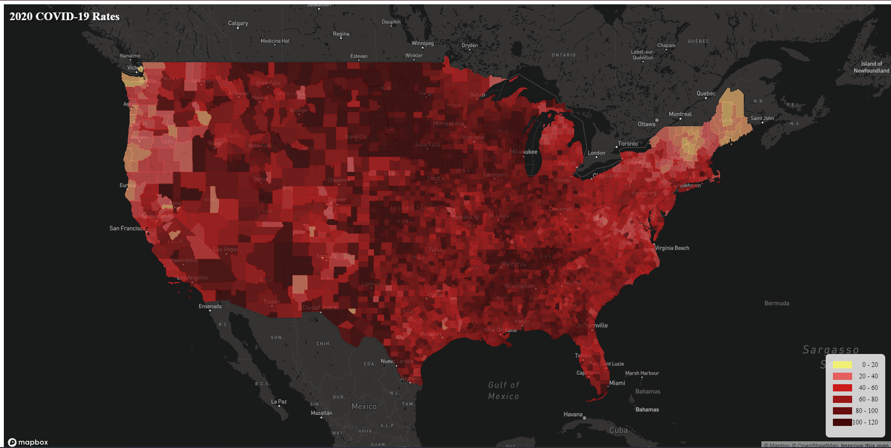
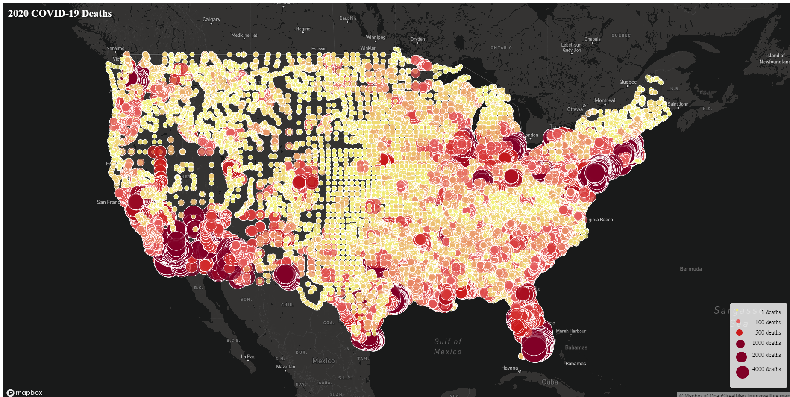

# Mapping COVID-19
This project presents an insightful exploration of COVID-19 data through two distinctive maps, each providing a unique perspective on the impact of the pandemic.

## Map 1: Chloropleth Map - COVID-19 Rates
The first map is a chloropleth map that visualizes COVID-19 rates across the United States. Utilizing data sourced from the 2018 American Community Survey (ACS) 5-year estimates at the county level, the map provides a comprehensive overview of the varying case rates across different regions. The U.S. county boundary shapefile, obtained from the U.S. Census Bureau, enhances the precision of the spatial representation.

[Explore Map 1](https://DustNguyen.github.io/mapping_covid/map1.html)

## Map 1: Proportional Symbols Map - COVID-19 Death Counts

The second map employs a proportional symbols approach to illustrate the impact of COVID-19 in terms of death counts. The symbology adjusts dynamically, with dot sizes ranging from 1 to 30 based on the scale of deaths. This map, like the first, is grounded in the 2018 ACS 5-year estimates at the county level, providing a detailed and nuanced portrayal of the pandemic's toll.

[Explore Map 2](https://DustNguyen.github.io/mapping_covid/map2.html)